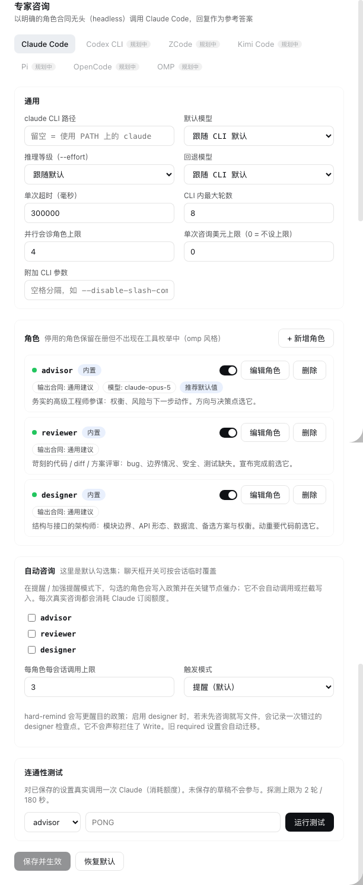

# dsh-capability-optimizer

[](LICENSE)
[](https://www.npmjs.com/package/@deepseek-ai/dsh)
[](lib)
[](https://github.com/hezhongtang/dsh-capability-optimizer/stargazers)

**External-expert consultation for [DeepSeek Harness](https://www.npmjs.com/package/@deepseek-ai/dsh): the agent headlessly invokes the Claude Code CLI through explicit advisor, reviewer, designer, or custom role contracts, then weighs the structured replies as reference answers.**

<p align="center">
  
</p>

English | [中文](README.zh-cn.md)

## Why this exists

A single harness has one perspective. At a consequential decision, before declaring risky work done, or before significant new code, a second model can supply useful independent evidence. That is a hypothesis to measure, not a guaranteed quality gain: persona research does not show that merely calling a model an expert reliably improves accuracy. This plugin makes consultation a bounded tool call instead of a copy-paste detour. Claude answers under a behavioral and output contract, and DSH receives the result as advice to **weigh, not obey**.

Phase 1 speaks only to the Claude Code CLI. The settings schema (v2, one workspace per harness), the UI tab catalog, and the runner seam are already multi-backend: `codex`, `zcode`, `kimi-code`, `pi`, `opencode`, and `omp` each land later as a runner behind the same three tools.

## Features

| | |
|---|---|
| 🎭 **Role contracts** | Built-in advisor / reviewer / designer with different objectives and JSON contracts, or your own (`outputKind`, prompt, model, fallback, effort). `enabled` parks a role without deleting it |
| 🧠 **Thinking effort** | Native `--effort` (low / medium / high / xhigh / max) at three levels: per-call argument > role > global default |
| 🔄 **Model fallback** | One-hop retry on model-level errors (`unrecognized_model`, model-not-found, …) with `usedFallback` recorded in run metadata |
| 🤖 **Agent tools** | `consult_expert` (one role, one question) · `consult_panel` (up to N roles in parallel, one wall-clock wait) · `consult_roles` (live roster) |
| 🎛 **Auto consult** | Composer-seat toggle (permissions row) picks roles per session; a policy section rides the system prompt and lifecycle nudges fire at write/finish anchors, budgeted per role per session |
| 🖥 **Settings workspace** | One tab per harness CLI; saves hot-apply — role edits reach the agent's next model step without a dsh restart |
| 🔬 **Connectivity test** | One real consultation end-to-end (CLI + login + proxy) with turns, duration, cost, and fallback marker |
| 🛡 **Defense in depth** | Read-only CLI tools, strict MCP isolation when supported, permission pinning, typed schemas, bounded output/turns/time, and explicit untrusted-evidence labels |
| 🌐 **Fully bilingual** | Every UI string — including built-in role descriptions, reserved-backend notes, and validation messages — follows the UI language (zh/en); agent tooling keeps stable English identifiers |

## Install

```sh
# from npm (recommended)
dsh plugin --profile web add dsh-capability-optimizer

# or straight from the GitHub repo
dsh plugin --profile web add github:hezhongtang/dsh-capability-optimizer
```

Restart `dsh web` (or your profile of choice). Works in any profile — web, tui, headless — because the tools are host-side agent tools.

Requirements: the `claude` CLI (`npm i -g @anthropic-ai/claude-code`) on PATH, logged in.

## Usage

Ask your agent:

> "consult the reviewer on this diff before we call it done"

The agent picks the role and calls `consult_expert`. For a precise task it can send a structured `brief`: trusted `objective`, `successCriteria`, and `constraints`, plus `currentAttempt`, `artifacts`, `verification`, and `unknowns`, which are explicitly labeled untrusted evidence. Legacy `context` remains an artifact shorthand. Claude's role-specific envelope returns with model, turns, duration, cost, and protocol metadata.

| Tool | Read/Write | Purpose |
|---|---|---|
| `consult_expert` | read* | One role, one question, optional structured `brief` (or legacy `context`), optional `model` / `effort` overrides |
| `consult_panel` | read* | Several distinct role contracts on one brief, in parallel; this is not a majority vote |
| `consult_roles` | read | Live roster including `outputKind`, role-level model/effort, and global defaults |

\* Read-only for your workspace; each call spends your Claude subscription quota — the tool descriptions themselves tell the model to batch material instead of machine-gunning calls.

## Auto consult

The composer toolbar (the permissions control's row) carries an Expert Consult toggle. Checked roles add selection criteria and lifecycle reminders for this session; the plugin does not invoke them automatically.

- **Policy section**: every model request names the checked roles and their selection conditions: advisor at consequential decisions, reviewer before declaring changed work done, and designer before significant new code. Modes are `off | remind | hard-remind` (default `remind`). Legacy `required` settings migrate to `hard-remind`.
- **Lifecycle nudges**: when designer is enabled, the first file write arms a next-step nudge if pre-code consultation did not happen; a changed turn about to finish without a successful reviewer consultation is steered one more step. `hard-remind` additionally logs the missed designer checkpoint but never claims the host blocked Write.
- **Budget**: `capPerRole` (default 3) counts real `consult_*` calls per role per session — nudges and the model's own discretionary calls share it. At the cap the promise drops out of the policy text and the anchors go quiet.
- **Soft by design**: a nudge guarantees the instruction is delivered, never the tool call — dsh has no forced-call API. A model that declines must state the reason in one line.
- The popover shows live usage counts (`used/cap`) per role; the last selection is remembered per browser. **Settings → Expert Consult → Auto consult** edits the default checked set and budget (row-config key `autoConsult`) — the same layer tui/headless profiles consume.

## Settings UI

**Settings → Expert Consult** is organized as one workspace per harness CLI — a tab bar over the catalog (`claude-code` live; `codex`, `zcode`, `kimi-code`, `pi`, `opencode`, `omp` reserved with a planned-status page and no settings stored until their runners land). The Claude Code workspace manages everything at runtime:

- **General** — CLI path, default model (catalog aligned with the supported Claude CLI aliases and versioned ids), thinking effort (`--effort`: low/medium/high/xhigh/max), fallback model, per-call timeout, max turns, panel size, per-consult dollar cap, extra CLI args (allowlisted; `--settings` is refused).
- **Roles workspace** — add / edit / delete roles, each with name, label, description, output contract (`advisor | reviewer | designer | general`), system prompt, model, fallback, and effort. Disabled roles stay in the roster but leave the tool enum.
- **Auto consult** — the default checked set, per-role per-session call budget, and trigger mode (`off | remind | hard-remind`); the composer toggle overrides the checked set per session.
- **Connectivity test** — one real consultation end-to-end (CLI + auth + proxy), showing the effective model, turns, duration, cost, and a fallback-used marker.
- **Save & apply** persists to `~/.dsh/dsh-capability-optimizer/settings.json` (atomic writes, 0600) and hot-applies: the agent tools re-register immediately. **Reset** removes the file and restores defaults.

Call-site `model` / `effort` override role values, which override global defaults. The built-in advisor defaults to `claude-opus-5` as an overridable quality preference, not a role-name-based prohibition. `fallbackModel` retries once on a model-level error and records `requestedModel`, CLI-reported `actualModel` / `actualModels`, derived `effectiveModel`, and `usedFallback`.

## Configure (composition layer)

The row's config still works as the base layer (settings file wins once saved):

| Key | Default | Meaning |
|---|---|---|
| `cliPath` | `claude` | Path to the CLI when it is not on PATH. |
| `model` | CLI default | Model alias (`opus`, `sonnet`, ...) applied when a call does not specify one. |
| `timeoutMs` | `300000` | Wall-clock cap per consultation. |
| `maxTurns` | `8` | Agentic turn cap inside the CLI. |
| `maxPanelRoles` | `4` | Roles per `consult_panel` call. |
| `maxBudgetUsd` | `0` | Per-run dollar cap (`--max-budget-usd`) when the CLI supports it. `0` means no cap. |
| `extraArgs` | `[]` | Extra CLI args, allowlisted. Flags that widen permissions, break the JSON protocol, or duplicate typed settings are dropped and reported. |
| `roles` | built-ins | Custom roles: add new ones, or override a built-in by reusing its name. |
| `autoConsult` | `{ enabled: [], capPerRole: 3, mode: 'remind' }` | Default checked set, per-role per-session budget, and trigger mode (`off \| remind \| hard-remind`). Legacy `required` migrates. |

Example — a security-focused custom role:

```yaml
- id: dsh-capability-optimizer
  name: 'dsh-capability-optimizer'
  config:
    model: sonnet
    roles:
      - name: security
        outputKind: reviewer
        description: Threat-model focused reviewer for auth, crypto, and injection surfaces.
        systemPrompt: |-
          Objective: falsify the security of the supplied change.
          Report only concrete authentication, authorization, injection,
          secret-handling, or unsafe-parsing defects with a trigger and evidence.
```

## How a consultation runs

- One `claude -p` process per consultation. The labeled brief goes through **stdin**, the shared trust policy and selected role contract through `--append-system-prompt`, and the reply comes back as one JSON document.
- The headless session is contained by feature-detected runtime flags. On current CLIs, `--safe-mode` disables user/project instructions, skills, plugins, hooks, MCP, and memory while preserving authentication and built-in tools. Independent layers still apply `--tools Read,Grep,Glob`, `--strict-mcp-config`, `--setting-sources user`, a pinned `--permission-mode`, and `--no-session-persistence`; older CLIs use whichever layers they advertise. Write/execute or external-capability-widening `extraArgs` never reach argv; the documented `--add-dir` exception may widen read scope. Caller cancellation (`AbortSignal`) and the wall-clock timeout stay distinguishable.
- Wall-clock timeout (default 5 min) with SIGTERM → SIGKILL escalation; `--max-turns` (default 8) caps agentic turns inside the CLI.
- Advisor, reviewer, designer, and general roles receive different JSON Schemas using Claude's documented supported subset. Local parsing enforces unsupported constraints such as non-empty strings and checks semantic invariants (for example, `pass` cannot contain findings); schema-valid JSON is not treated as proof that its claims are true.
- Only `objective`, `question`, `success-criteria`, and `constraints` define the task. Code, comments, files, current attempts, verification text, unknowns, and tool results are labeled untrusted evidence. This is a model-layer control, not a claim that prompt injection is solved.

## Security & data flow

**What the plugin guarantees:**

- The plugin never passes `--dangerously-skip-permissions` or any permission-bypassing flag. `extraArgs` is an allowlist, not a passthrough. On a CLI that advertises the containment flags, a consultation gets exactly `Read`, `Grep`, `Glob` and no MCP server — verified against a real CLI, including against a project whose own `.claude/settings.json` asks for `bypassPermissions` ([evidence](docs/plan/s1-consultant-permission-surface.md), reproducible with `DCO_LIVE_CLI=1 npm test`). Each flag is feature-detected, so a CLI too old to advertise it degrades rather than failing; `meta.safeMode` / `meta.tools` / `meta.strictMcp` / `meta.permissionMode` report what was actually enforced.
- Prompts travel as argv/stdin to the local CLI only — the plugin itself adds no third-party service, no telemetry, no credential storage. Routes enforce same-origin; the settings file is 0600 and atomically written; subprocess output is size-capped and timeouts always reap the child.
- Claude's reply is returned to the DSH agent as tool-result **data** and framed as a reference answer to weigh ("advice, not orders"); it is not granted privileged instruction authority.

**What you should know (inherent to any agent-consults-agent setup):**

- **Your material leaves this machine to your own Claude account.** The question plus any code/diff/plan passed as context is processed by the Claude Code CLI under the account you logged in with — the same data flow as running `claude -p` yourself. Do not paste secrets you would not send to Claude directly.
- **Enterprise managed policy remains a host trust boundary.** Claude documents that admin-managed policy still applies in safe mode; the plugin does not and should not bypass organization policy.
- **Prompt injection is possible, not eliminated.** Data/instruction separation, schemas, and the reference-answer framing reduce risk; runtime read-only permissions, MCP isolation, output caps, and the caller's independent verification limit the blast radius. Treat replies like other external evidence, not privileged instructions.

## Evaluation status

The repository includes a controlled reviewer benchmark comparing a role-free minimal contract, the frozen 0.5.x prompt, and the current prompt on the same model/effort/tasks over repeated trials. It records prompt hashes, seeded-defect recall, unmatched findings, injection success, envelope reliability, cost, latency, containment, and CLI-reported model(s). Formal runs abort if the reported model does not exactly match the preregistered model. Dry-run plumbing passes; no formal paid result is claimed here. See [`eval/README.md`](eval/README.md) and the [evidence review](docs/research/prompt-role-evidence.md).

Advisor and designer have role-specific contract tests, but no outcome benchmark yet. Their presence is an interface and workflow choice—not evidence that expert persona wording raises intelligence.

## Limitations

- Phase 1 is Claude Code only; the multi-backend settings schema (v2, one workspace per harness) and UI tabs for codex / zcode / kimi-code / pi / opencode / omp are already in place — each lands as a runner behind the same tools.
- Each consultation spends your Claude subscription quota; the tool descriptions tell the model to batch material instead of machine-gunning calls.
- No streaming — one JSON result per call.

## Contributing

Issues and PRs welcome at [hezhongtang/dsh-capability-optimizer](https://github.com/hezhongtang/dsh-capability-optimizer). The codebase is intentionally small and dependency-free — plain ESM on the host, a hand-authored CJS bundle in the browser, no build step to set up. Adding a harness backend = one runner module (see `lib/claude.js`) + flipping `available` in `lib/backends.js`.

## License

[MIT](LICENSE) © 2026 hezhongtang
